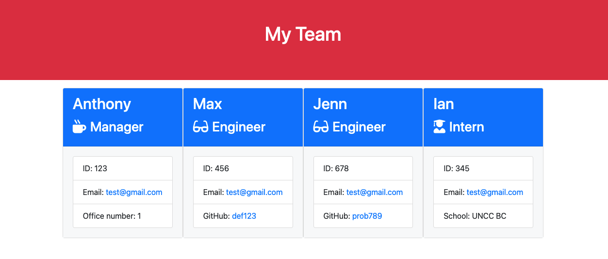
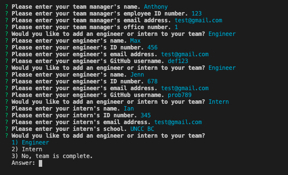

# Team Profile Generator  
    
  ## Description  
  This project allows a user to enter information about their team through inquirer, a coommand line interface. After the data has been input, a HTML document is automatically rendered in order to display the team information. 

  ## Images of Application
    
  

  ## Table of Contents   
  [Installation](##Installation)  
  [Usage](##Usage)  
  [License](##License)  
  [Contributiing](##Contributing)  
  [Tests](##Tests)  
  [Questions](##Questions)
    
  ## Installation  
  This project requires the instalation of inquirer, jext, and jest.  
  ## Usage  
  To utilize this application after installation, run the command `npm start` from the terminal window. From here, the prompts will provide a guide for user input. After the desired information has been given, the web page may be accessed in the HTML folder. By opening index.html in the user's web browser of choice, they may view the completed product. This **[VIDEO LINK](https://drive.google.com/file/d/1eiQvIWAZGraGvirZrKgrHuDwtvR5Co5P/view)** provides a thorough demonstration of usage.
  ## License   
  This project is not licensed.    
  ## Contributing/Credits
  There are no guidlines for contribution at this time. Many thanks to Anthony Cooper, Max Allee, and Brian Ford for providing starter code and support for this project.   
  ## Tests   
  Jest has been utilized for testing of this application. If it is desired to run the tests provided, or if additional tests are added, they may be run with the command `npm test` from the terminal. This **[VIDEO LINK](https://drive.google.com/file/d/1dphBCvNaN4JEQXDpyvaTV5v54u9KgEjX/view)** provides a demonstration for running tests as well as the passing of all tests currently defined. 
  ## Questions  
  I can be reached at mcbrayer.ian@gmail.com for further information.  
  Please feel free to also check out my work at https://github.com/ihm57511
